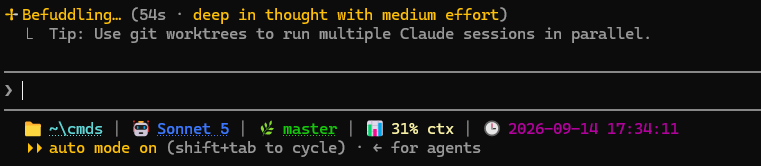

# cmds

A personal collection of system-wide CLI commands. Add `~\cmds` to your `PATH` and use these commands from any terminal.

## Prerequisites

- **[PowerShell 7+ (pwsh)](https://learn.microsoft.com/en-us/powershell/scripting/install/installing-powershell-on-windows)** — required. Every command's `.bat` file launches its script with `pwsh`, not Windows PowerShell (`powershell.exe`) or cmd.exe alone.
- **[Git for Windows](https://git-scm.com/download/win)** — optional. Without it, the Claude Code status line just omits the git branch segment; everything else works fine.
- **[Windows Terminal](https://aka.ms/terminal)** — recommended. The status line's clickable folder/model/branch links (OSC 8 hyperlinks) need a terminal that supports them; older consoles show the plain text instead.
- **[Claude Code](https://claude.com/claude-code)** — only needed if you want the status line feature; the other commands don't depend on it.

## Setup

Add the `cmds` directory to your system PATH:

```powershell
# Run once in an elevated PowerShell session
$cmdsPath = "$HOME\cmds"
$currentPath = [Environment]::GetEnvironmentVariable("Path", "User")
if ($currentPath -notlike "*$cmdsPath*") {
    [Environment]::SetEnvironmentVariable("Path", "$currentPath;$cmdsPath", "User")
}
```

Restart your terminal for the change to take effect.

## Architecture

```
cmds\
├── _run.ps1          # Single entry point for all commands
├── scripts\          # PowerShell implementation for each command
│   ├── _common.ps1   # Shared formatting helpers (colors, hyperlinks); not a command itself
│   ├── ls.ps1
│   └── cdwork.ps1
├── .dotfiles\        # User configuration files
│   └── .cdwork       # Work directory path for cdwork
├── ls.bat
└── cdwork.bat
```

Each command is a `.bat` file that delegates to `_run.ps1`, which:
1. Prints the command name in magenta
2. Logs the invocation with a timestamp to `logs\commands.log`
3. Calls the matching script under `scripts\`

To add a new command:
1. Create `scripts\mycommand.ps1`
2. Create `mycommand.bat` using an existing `.bat` as a template

## Note on directory-changing commands in PowerShell

Commands like `cdwork` that change the current directory work in **CMD** but not in PowerShell, because the `.bat` subprocess cannot modify the parent shell's directory. For PowerShell, add a wrapper function to your `$PROFILE`:

```powershell
function cdwork { Set-Location (& "$HOME\cmds\scripts\cdwork.ps1") }
```

## Commands

### `ls`

Lists directory contents using `Get-ChildItem`. Allows `ls` to work in CMD.

```
ls [path]
```

### `cdwork`

Changes the current directory to the configured work directory.

```
cdwork
```

Configure the work directory by editing `~\cmds\.dotfiles\.cdwork` — put the full path on a single line. Lines starting with `#` are ignored. The path supports `~` shorthand for your home directory (e.g. `~\Documents\code`); it's resolved to a full absolute path before use, since `cmd.exe`'s `cd /d` doesn't understand `~` itself.

### `cmds`

Lists every available command in a table: its name (Ctrl+click to open that command's script), its description (from the `# DESCRIPTION:` line in its script), and — for a command like `cdwork` that reads a `.dotfiles\.<name>` file — the value it's currently configured to. Any command following that `.dotfiles\.<name>` convention picks up this column automatically, with no changes needed to `cmds.ps1` itself.

```
cmds
```

## Claude Code plugins

This repo also publishes a Claude Code plugin marketplace — see
[`plugins/README.md`](plugins/README.md) for installation and the
`notifywhen` command family (background condition watcher with a windowed
chime notification).

## Claude Code status line



`scripts\claude-statusline.ps1` renders a Claude Code status line showing the session's launch directory, active model, git branch, context window usage, and current date/time. The model and context fields only appear once Claude Code has sent that data (they're absent on the very first render of a session). The folder shown is `workspace.project_dir` (where the session was launched from), not `workspace.current_dir` (the live working directory) — so it stays put even after Claude `cd`s elsewhere internally; the git branch still reflects wherever the session currently is. A `%USERPROFILE%` prefix on the shown folder is collapsed to `~` (e.g. `C:\Users\you\cmds` → `~\cmds`). The folder is also an OSC 8 hyperlink to a `file://` URI, so Ctrl+click (Cmd+click on macOS) opens it in File Explorer on terminals that support clickable links, such as Windows Terminal. The model name links to that model's page on platform.claude.com, and the git branch links to that branch on github.com (only when the repo's `origin` remote is a GitHub URL).

The status line wraps onto additional lines when the segments don't fit in the terminal width, using the `COLUMNS` environment variable Claude Code sets before running the script (each line the script writes renders as its own status-line row).

To enable it, add this to `~\.claude\settings.json`:

```json
{
  "statusLine": {
    "type": "command",
    "command": "pwsh -NoProfile -File C:/Users/<you>/cmds/scripts/claude-statusline.ps1",
    "refreshInterval": 15
  }
}
```

Fully quit and relaunch `claude` afterward — the `statusLine` setting is only read at startup.

**Windows gotchas:**

- Claude Code runs `statusLine` commands through Git Bash when it's installed, and Git Bash treats unquoted backslashes as escape characters. A `command` path written with backslashes (e.g. `C:\Users\...\claude-statusline.bat`) gets silently mangled and the status line never appears, with no visible error. Always use forward slashes in the `command` path, as shown above.
- When `pwsh -File` is invoked from a Git Bash pipe (as Claude Code does here), `[Console]::In.ReadToEnd()` does not see the piped JSON even though the pipe is real — it silently reads empty. The script reads stdin via the `$input` pipeline variable instead, which works in both this piped scenario and when the script is run standalone by hand.
